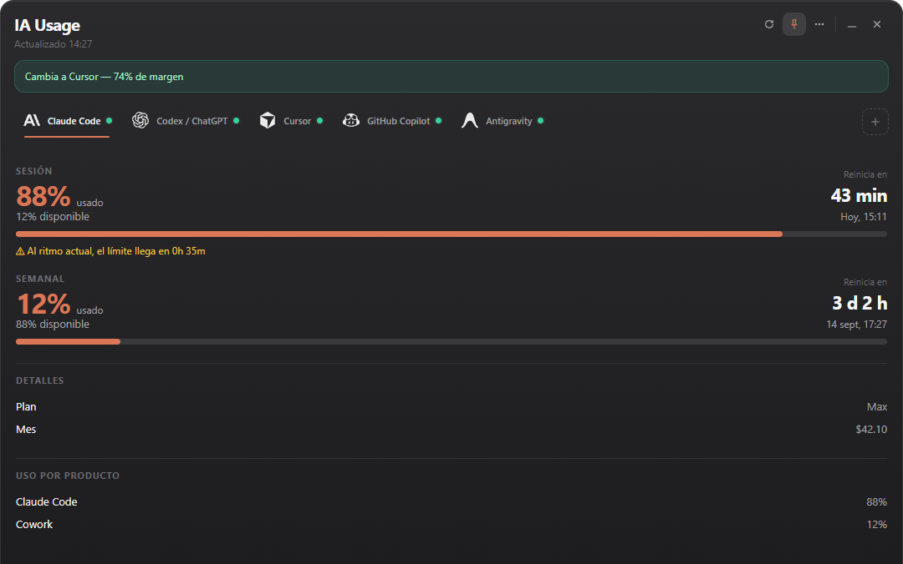
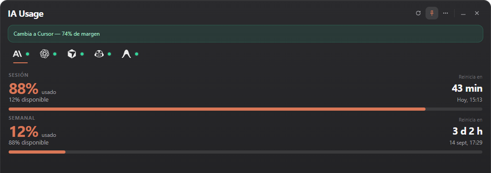
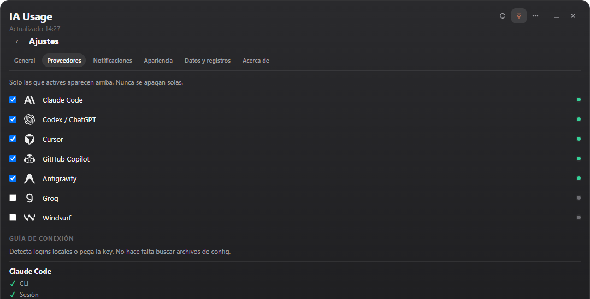

# IA Usage

<picture>
  <source media="(prefers-color-scheme: dark)" srcset="assets/brand/source/ia-usage-wordmark-dark.svg">
  
</picture>

[](https://github.com/Shadelight/ia-usage-bar/releases/latest)
[](https://github.com/Shadelight/ia-usage-bar/actions/workflows/build.yml)


**Monitor AI quotas, reset times, and spend across your tools from one Windows tray app.**

### [⬇ Download the latest release](https://github.com/Shadelight/ia-usage-bar/releases/latest)

[Website](https://shadelight.github.io/ia-usage-bar/) · [Installation](#install) · [Supported providers](#supported-providers) · [Privacy](#privacy--security)

## Why IA Usage

Most people using AI tools today juggle more than one subscription — Claude
Code, Codex, Cursor, Copilot, a couple of pay-per-token APIs. Checking "how
much do I have left" means opening a different dashboard for each one. IA
Usage puts every provider's session/weekly quota, reset countdown, and
spend in one resident tray window, so you know before you hit a wall.

## Features

- Multi-provider usage monitoring — enable only the providers you use; the
  app never turns one off for you.
- Session, rolling-window, and weekly/monthly quotas per provider, with
  exact and relative reset times.
- Used vs. remaining percentages, pace warnings when you're burning faster
  than the window allows, and stale-data handling when a provider is
  temporarily unreachable.
- Structured connection status per provider (needs login, needs permission,
  service unavailable, rate limited) instead of a single generic error.
- Tray-resident app: minimize, close-to-tray, single-instance, tray icon
  paints the primary provider's usage.
- Pin (always-on-top) and compact window modes, both remembered across
  restarts and mirrored in the tray menu.
- Configurable notification thresholds and autostart with Windows.
- Per-provider connection guide and, where a provider publishes one, direct
  links to its official usage/status page.
- Event-driven Codex session updates (two-second debounce) with controlled
  remote polling, plus a VS Code-compatible status-bar companion.
- Local diagnostics export for bug reports (sanitized — no tokens, no keys).
- API keys are stored in Windows Credential Manager, never in plain
  `config.toml`. No telemetry.

## Supported providers

| Provider | Connection | Notes |
|---|---|---|
| Claude Code | OAuth (`claude` CLI login) | Session + weekly quotas, local cost estimate from `~/.claude` logs |
| Codex / ChatGPT | OAuth (`codex login`) | 5h + weekly quotas |
| Cursor | Local session (IDE `state.vscdb` or `cursor-agent`) | Plan usage by model group |
| Antigravity | Local language server / Google session | Per-bucket quotas |
| GitHub Copilot | `gh auth token` or `GITHUB_COPILOT_TOKEN` | Premium interactions + chat quota |
| OpenAI API | `OPENAI_ADMIN_KEY` | Org cost/usage, not a personal ChatGPT plan |
| Anthropic API | `ANTHROPIC_ADMIN_KEY` | Org cost/usage |
| OpenRouter, Z.AI, DeepSeek, Grok, Kimi, Kilo, Novita, Moonshot, MiniMax, Groq, Kiro, Nous, SuperGrok, Command Code, OpenCode Go, Windsurf | API key (Settings or environment variable) or local session, depending on the vendor | Credit/usage fields vary by API — see the in-app connection guide for each |

Full auth details and per-provider hints are shown in **Settings → Proveedores**.

## Screenshots

<table>
<tr>
<td></td>
<td></td>
<td></td>
</tr>
</table>

## Install

**Requirements:** Windows 10/11. For Claude/Codex/Cursor, sign in to those
apps once beforehand.

1. Download the installer from [GitHub Releases](https://github.com/Shadelight/ia-usage-bar/releases/latest)
   — either the NSIS setup `.exe` or the `.msi`.
2. Run it.
3. Launch **IA Usage** from the Start menu.
4. Open Settings and enable the providers you use (or click **Detect the
   ones I already use**).

> Builds are not code-signed yet, so Windows SmartScreen may warn on first
> run ("Windows protected your PC"). Click **More info → Run anyway**. This
> is expected for an unsigned open-source installer, not a sign of tampering
> — verify the SHA256 checksum published with the release if you want to be
> sure.

## Development

```powershell
npm install
npm run tauri dev      # development, hot reload
npm run build           # frontend production build
npm run test:frontend
cargo test --manifest-path src-tauri/Cargo.toml
npm run tauri build     # NSIS + MSI installers
```

Config lives at `%APPDATA%\ia-usagebar\config.toml`. Logs and diagnostics
export to `%APPDATA%\ia-usagebar\logs\`.

## How provider detection works

On first launch, IA Usage checks for local logins (CLI session files,
Windows Credential Manager entries) and enables the providers it finds —
it never disables one for you afterward. Providers without a local session
need a manually pasted API key, saved through Settings into Windows
Credential Manager.

## Privacy & security

**Your credentials stay on your machine.** IA Usage reuses sessions and
credentials that already exist locally when a provider allows it — OAuth/CLI
login, device flows, local session files, user-configured API keys — instead
of asking you to re-authenticate.

- Read-only and local-first. **No telemetry.**
- Tokens are read from files the official CLIs already maintain (e.g.
  `~/.claude`, `~/.codex/auth.json`) or from Windows Credential Manager —
  never copied anywhere else.
- Each provider is contacted only for its own usage endpoint, using the
  credential you already have for it.
- Manually entered API keys are stored in Windows Credential Manager via the
  Rust `keyring` crate, not in plaintext config.
- See [SECURITY.md](SECURITY.md) for the full policy and how to report a
  vulnerability.

## Notifications

Alerts fire once per threshold per usage window (defaults: 75%, 90%, 95%,
configurable in Settings → Notificaciones), plus a notice when a window
resets.

## Compact mode / tray behavior

Compact mode (Settings → Apariencia, the header `⋯` menu, or the tray)
shrinks the window to the selected provider's primary quota and hides
secondary detail. Pin keeps the window always-on-top; both states persist
across restarts. Closing the window sends it to the tray instead of
quitting — use **Exit** from the tray menu or the footer to actually quit.

## Troubleshooting

| Symptom | Likely cause |
|---|---|
| Provider shows "needs login" | Sign in to that provider's app/CLI, then use **Detect** or **Refresh** |
| Provider shows "needs permission" | The saved credential can authenticate but can't read usage — check the account's plan/permissions |
| "Application is not responding" | The provider's local app/service isn't running |
| Data looks stale / an amber warning appears | The last refresh failed; IA Usage keeps the last good numbers instead of showing nothing |
| Something is just wrong | Settings → Datos y registros → **Exportar diagnóstico**, attach the file to a bug report |

## Roadmap

Only items with an approved design so far:

- Signed installers (removes the SmartScreen warning).
- Expanding the provider-links registry (usage/billing/status pages) as
  more official URLs are verified.

The Android companion is implemented in [`android/`](android/README.md): it
pairs over the local encrypted sync protocol, keeps an encrypted offline
snapshot and includes a home-screen widget. Remote relay sync is intentionally
not part of this local-first release.

The VS Code companion lives in
[`apps/vscode-extension/`](apps/vscode-extension/README.md). It is a visual
client of `iausage watch --jsonl`, never a second provider collector.

## Contributing

See [CONTRIBUTING.md](CONTRIBUTING.md).

## Security

See [SECURITY.md](SECURITY.md).

## License

MIT. See [LICENSE](LICENSE).

## Third-party notices

IA Usage's provider architecture and connection patterns build on
several MIT-licensed open-source projects, including the original Claude
Bar by Daybi that this project started from. Full attribution is in
[NOTICE](NOTICE).
